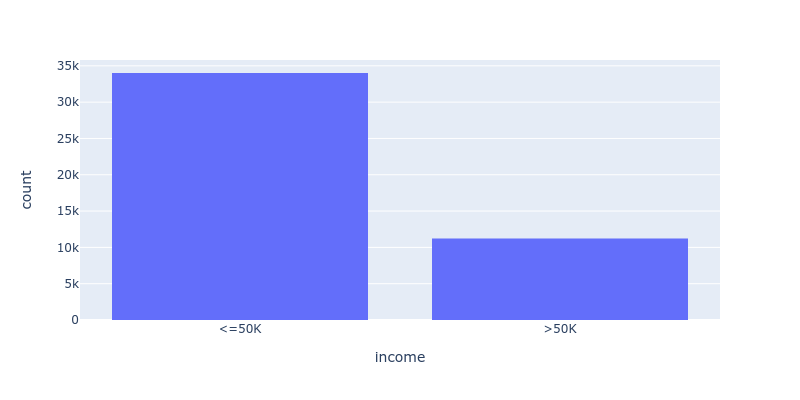

# Intro to Machine Learning with PyTorch - Project 1
# Finding Donors for a Charity

This project develops a supervised machine learning model which identifies potential donors for a charity by predicting their income bracket.

This is the 1st project in Udacity's Introduction to Machine Learning with PyTorch Nanodegree [1]. This README serves as a final report for this project.

 

# Table of Content

INSTALL

- [Install](#install)
- [Project Files](#project-files)

PROBLEM DEFINITION

- [Customer Problem](#customer-problem)
- [Technical Requirements](#technical-requirements)

DATA

- [Data Exploration](#data-exploration)
- [Data Cleaning](#data-cleaning)

DESIGN

- [Pipeline](#pipeline)
- [Data Loader](#data-loader)
- [Data Pre-Processor](#data-pre-processor)
	- [Features](#features)
	- [Targets](#targets)
- [Machine Learning Model](#machine-learning-model)
	- [Evaluation Metrics](#evaluation-metrics)
	- [Datasets](#datasets)
	- [Model Selection](#model-selection)
	- [Hyperparameter Search](#hyperparameter-search)
	- [Testing](#testing)
- [Implementation](#implementation)

DEPLOYMENT

- [Instructions For CharityML](#instructions-for-charityml)
	- [How to Compile Data](#how-to-compile-data)
	- [How to Run the Model](#how-to-run-the-model)

CONCLUSION

- [Possible Improvements](#possible-improvements)
- [References](#references)

# Install

1 - Clone this repository.

	$ cd ~
	$ git clone https://github.com/martin0004/charity_donors_finder.git

2 - Install miniconda.

	$ https://docs.conda.io/en/latest/miniconda.html

3 - Create conda environment for this project.

The command below creates the "charityml" conda environment, which stands for "CharityML", the name of the charity in this project.

	$ cd ~/charity_donors_finder/install
	$ conda env create --file environment.yaml   # Creates charityml environment

4 - Activate environment.

	$ conda activate charityml

5 - Run the donor identifier on a dummy csv file.

The script prints one number for each person. 0 = "low income". 1 = "high income".

    (charityml) $ cd ~/charity_donors_finder/src
    (charityml) $ python3 find_donors.py input.csv
    (charityml) $ cat predictions.csv
    0    
    0
    1
    0
    0

6 - [OPTIONAL] Open the Jupyter Notebooks which was used for developing the donor finder.

	(charityml) $ cd ~/charity_donors_finder
	(charityml) $ jupyter lab
	
	then navigate to /dev/data_exploration.ipynb
	                 /dev/data_cleaning.ipynb
	                 /dev/design.ipynb
	                 /dev/deployment.ipynb

# Project Files

The most important files & directories in this project are listed below.

```
data/
    census.csv                   Original census data - provided by Udacity.
    census_cleaned.csv           Census data cleaned (spaces removed, all lower case, ...)

dev/
    data_exploration.ipynb       Notebook for exploring data.
    data_cleaning.ipynb          Notebook for cleaning data.
    design.ipynb                 Notebook for designing data loader, data preprocessor
                                 and machine learning model.

images/                          Images used in the README.

install/
    environment.yaml             Conda environment file.
    
src/
    find_donors.py               Code of donor finder.
    input.csv                    Input file where CharityML can collect donor data.
                                 Contains 5 dummy entries for performing 1st test.
    features.csv                 List of exact feature names & values for input.csv.

```

# Customer Problem

CharityML, a non-profit teaching machine learning to children of low-income families, needs to identify potential donors for its annual fundraising campaign.

Due to limited resources, CharityML can only send a small amount of sollication letters per year and wants to focus on households which make more than 50,000 USD per year.

CharityML would like a simple model which can predict a potential donor's income based on other factors, such as age, marital status and education level.

# Technical Requirements

- Find a simple machine learning model which can predict a person's income bracket based on this person's demographics (age, marital status, education, ...).
- Define evaluation metrics for this model using a naive predictor.
- Implement the model in Python so it can be run on a csv file from the command line.
- Provide guidance to CharityML for the following.
    - How to collect data (i.e. format of csv file for compiling donors data).
    - How to run the model.


# Data Exploration

### Input Data

The ML model of this project is trained using a subset of the 1994 US census data from the UCI Machine Learning Repository [2][3]. The dataset contains 45222 entries and is available in file `census.csv`.

Data in the file is divided into 2 classes: low income earners (<=50K per year) and high income earners (>50K per year).

| Class (income) | Number of entries |
|----------------|-------------------|
| <=50K          | 34,014             |
| >50K           | 11,208             |
| -              | -                 |
| Total          | 45,222             |


### Column Values


| Column          | Type         | Values        |
|-----------------|--------------|---------------|
| age             | numerical    | 17-90         |
| workclass       | categorical  | ' Federal-gov' ' Local-gov' ' Private' ' Self-emp-inc' ' Self-emp-not-inc' ' State-gov' ' Without-pay'          |
| education_level | categorical  | ' 10th' ' 11th' ' 12th' ' 1st-4th' ' 5th-6th' ' 7th-8th' ' 9th' ' Assoc-acdm' ' Assoc-voc' ' Bachelors' ' Doctorate' ' HS-grad' ' Masters' ' Preschool' ' Prof-school' ' Some-college' |
| education_num   | numerical    | 1-16          |
| marital-status  | categorical  | ' Divorced' ' Married-AF-spouse' ' Married-civ-spouse' ' Married-spouse-absent' ' Never-married' ' Separated' ' Widowed        |
| occupation     | categorical | ' Adm-clerical' ' Armed-Forces' ' Craft-repair' ' Exec-managerial'  ' Farming-fishing' ' Handlers-cleaners' ' Machine-op-inspct' ' Other-service' ' Priv-house-serv' ' Prof-specialty' ' Protective-serv' ' Sales' ' Tech-support' ' Transport-moving' |
| relationship   | categorical | ' Husband' ' Not-in-family' ' Other-relative' ' Own-child' ' Unmarried'  ' Wife' |
| race           | categorical | ' Amer-Indian-Eskimo' ' Asian-Pac-Islander' ' Black' ' Other' ' White' |
| sex            | categorical | ' Female' ' Male'    |
| capital-gain   | numerical   | 0-99999              |
| capital-loss   | numerical   | 0-4356               |
| hours-per-week | numerical   | 1-99                 |
| native-country | categorical | (about 40 countries) |
| income         | categorical | '<=50K' '>50K'       |


### Data Distributions


|                |          |
|-------------------------------------------|-------------------------------------------|
|    |      | 
|     |         | 
|       |               | 
|                |       | 
|       |     | 
|     |              | 


# Data Cleaning

Data exploration revealed some inconsistancies in the raw data format. Therefore, the following data cleaning tasks were performed on `census.csv` before moving to the model design phase.

- Remove all spaces from the csv file.
- Make all letters lower case.
- Replace underscores ( _ ) with dashes (-) in column names.

A sanity check was performed to ensure this cleaning did not change the data. The cleaned data was saved in `census_cleaned.csv`.


# Pipeline

The charity donor identifier pipeline is made of the following components. These components are similar to the pipeline from reference [4], without the feature extractor (the input file of this project already contains our features).

 


# Data Loader

The dataloader loads the census file in a format the machine learning model can manipulate. It can be used in 2 different ways.

- Method 1. If a column in the file represents targets, specify the target column name so the dataloader performs a feature/target split. Use this method for training a model.

	```
	dl = DataLoader("income")
	features, targets = dl.load(PATH_TO_FILE)
	```

- Method 2. If the model only contains features (no target column), initialize the dataloader without specifying a column name. Use this method when you want to perform predictions.

	```
	dl = DataLoader()
	features = dl.load(PATH_TO_FILE)
	```

# Data Pre-Processor

The data pre-processor transforms the census features and targets into range of values which the machine learning model can better understand.

### Features

First, it log transforms heavily skewed features.


Next, it normalizes numerical features. Note that log transformed features also get normalized.


It then one-hot encodes categorical features.


### Targets

Targets are integer encoded.


# Machine Learning Model

### Evaluation Metrics

The model performance is evaluated using accuracy and the F<sub>β</sub> score, with β = 0.5. This value of β puts more importance on precision, as we want to minimize the number of low-income people predicted high income.

Target values for these metrics are based on the metrics of a naive predictor which predicts everyone as a high-income earner.


| Metric                        | Naive Predictor <br> (Predicts everyone as "high income") | Our Model Target |
|-------------------------------|-----------|----------|
| Accuracy                      | 0.25      | ≥ 0.25   |
| F<sub>β</sub> score (β = 0.5) | 0.29      | ≥ 0.29   |
| Precision                     | 0.25      | not used |
| Recall                        | 1.00      | not used |


### Datasets

The census data was split in the following 3 datasets, which are reused in the tradeoff studies and final model selection.

| Dataset | Data Points | % Total |
|---------|-------------|---------|
| train   | 27,132      | 60      |
| valid   | 9,045       | 20      |
| test    | 9,045       | 20      | 

### Model Selection

A preliminary training phase was performed on 3 classifiers available in scikit-learn [5]. The model which performed the best, using default hyperparameters, was selected for the next phase of the project.

The following models were run.

- A Naive Bayes model (NB).
- A Random Forest Classifier (RFC).
- A State Vector Classifier (SVC).

The following observations were made.

- All 3 models performed better than the naive predictor (both on the training & validation datasets).

- The NB model did not perform very well. Since Scikit-learn does not provide many hyperparameters to tune this model, this model was discarded.

- The RFC had a much better F<sub>β</sub> score than the NB. However its validation metrics were much lower than the training metrics, indicating the model was most likely overfitting the training data. This model was also discarded.

- The SVC had great metrics. These metrics were similar on the training and validation dataset, indicating it generalizes well. It also did not overfit as much as the RFC. This model was selected for the next part of the project.


| Dataset | Metrics              | Naive Predictor | NB     | RFC     | SVC     |
|---------|----------------------|-----------------|--------|---------|---------|
| Train   | Training time        | -               | 0.03 s | 1.60 s  | 18.68 s |
|         | Accuracy             | -               | 0.57   | 0.98    | 0.85    |
|         | F<sub>β</sub> score  | -               | 0.42   | 0.96    | 0.71    |
| Valid   | Accuracy             | 0.25            | 0.57   | 0.84    | 0.83    |
|         | F<sub>β</sub> score  | 0.29            | 0.41   | 0.68    | 0.67    |


### Hyperparameter Search

An hyperparameter search was ran on the SVC model. Results are available below.

The following observations were made.

- The "best" model did not perform significantly better than the default hyperparameters.
- For this reason, an SVC model with the Scikit-Learn default parameters was selected as our final model.


|    | model   | param_kernel   | param_degree   | param_gamma |  param_C |   F<sub>β</sub> score | note    |
|----|---------|----------------|----------------|-------------|----------|-----------------------|---------|
|  0 | SVC     | linear         |              - |           - |      0.1 |              0.688507 |         |
|  1 | SVC     | linear         |              - |           - |      1.0 |              0.688654 | best    |
|  2 | SVC     | linear         |              - |           - |     10.0 |              0.688097 |         |
|  3 | SVC     | poly           |              3 |           - |      0.1 |              0.688617 |         |
|  4 | SVC     | poly           |              5 |           - |      0.1 |              0.683606 |         |
|  5 | SVC     | poly           |             10 |           - |      0.1 |              0.672058 |         |
|  6 | SVC     | poly           |              3 |           - |      1.0 |              0.685841 |         |
|  7 | SVC     | poly           |              5 |           - |      1.0 |              0.681203 |         |
|  8 | SVC     | poly           |             10 |           - |      1.0 |              0.662643 |         |
|  9 | SVC     | poly           |              3 |           - |     10.0 |              0.679906 |         |
| 10 | SVC     | poly           |              5 |           - |     10.0 |              0.664778 |         |
| 11 | SVC     | poly           |             10 |           - |     10.0 |              0.659454 |         |
| 12 | SVC     | rbf            |              - |      scale  |      0.1 |              0.683198 |         |
| 13 | SVC     | rbf            |              - |      scale  |      1.0 |              0.683996 | default |
| 14 | SVC     | rbf            |              - |      scale  |     10.0 |              0.681982 |         |
| 15 | SVC     | rbf            |              - |        0.1  |      0.1 |              0.682282 |         |
| 16 | SVC     | rbf            |              - |        0.1  |      1.0 |              0.687373 |         |
| 17 | SVC     | rbf            |              - |        0.1  |     10.0 |              0.682902 |         |
| 18 | SVC     | rbf            |              - |        1.0  |      0.1 |              0.623044 |         |
| 19 | SVC     | rbf            |              - |        1.0  |      1.0 |              0.65144  |         |
| 20 | SVC     | rbf            |              - |        1.0  |     10.0 |              0.649888 |         |
| 21 | SVC     | rbf            |              - |       10.0  |      0.1 |              0.456918 |         |
| 22 | SVC     | rbf            |              - |       10.0  |      1.0 |              0.625402 |         |
| 23 | SVC     | rbf            |              - |       10.0  |     10.0 |              0.616583 |         |


### Testing

The selected model (SVC with default hyperparameters) was ran on the test dataset.

- Metrics still met the requirements.
- It was concluded the model could now be used by CharityML.
- The trained model was saved to `/src/model.pkl` for later reuse.


| metrics         |   values | targets |
|-----------------|----------|---------|
| Accuracy (test) |     0.84 | ≥ 0.25  |
| F-Beta (test)   |     0.68 | ≥ 0.29  |


# Implementation

The ML pipeline components mentionned above were implemented in Python 3 in file `/src/find_donors.py` . See next section on how to run the pipeline.


# Instructions for CharityML

### How to Compile Data

CharityML can collect its potential donors data into file `src/input.csv`. This file currently contains 5 dummy entries as an example. Note that this file should not contain column `income`.

 

The exact values to use for each categorical features are available in file `src/features.csv` .


### How to Run the Model

Once data collection is completed, predictions can be made on `input.csv` with the following commands. This will create file `output.csv`, which contains one line per entry in `input.csv`. 0 = "low income" 1 = "high income".

    (charityml) $ cd ~/charity_donors_finder/src
    (charityml) $ python3 find_donors.py input.csv
    (charityml) $ cat output.csv
    0    
    0
    1
    0
    0


# Possible Improvements

- Perform basic data integrity checks on the input.csv file before running the model.
	- Check columns are named correctly
	- Check field values match those from file `features.csv`
- Modify project so all model parameters are in a configuration text file.
	- List of features which must be log-transformed.
	- List of numerical features.
	- Location of ``model.pkl` file.
	- (...)
- Modify the model so it can accommodate "other" as a country.
- Explore the possibility of replacing `native-country` field values by group of countries (us-canada, latin-america, pacific, europe, ...).

# References

[1] Udacity's Introduction to Machine Learning with PyTorch Nanodegree. https://www.udacity.com/course/intro-to-machine-learning-nanodegree--nd229

[2] UCI Machine Learning Repository, Census Income Dataset, https://archive.ics.uci.edu/ml/datasets/Census+Income

[3] Udacity, Instructions for this project, https://github.com/udacity/machine-learning/blob/master/projects/finding_donors/finding_donors.ipynb

[4] Udacity's Introduction to Self-Driving Cars Nanodegree, Part 8 - Computer Vision and Machine Learning, Lesson 1 - Computer Vision and Classification, Section 7 - Image Classification Pipeline. 

[5] Scikit-Learn, https://scikit-learn.org/stable.

[6] Serrano, Luis, Grokking Machine Learning, Manning Editions.
